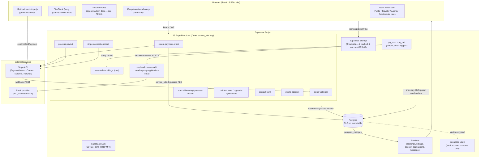
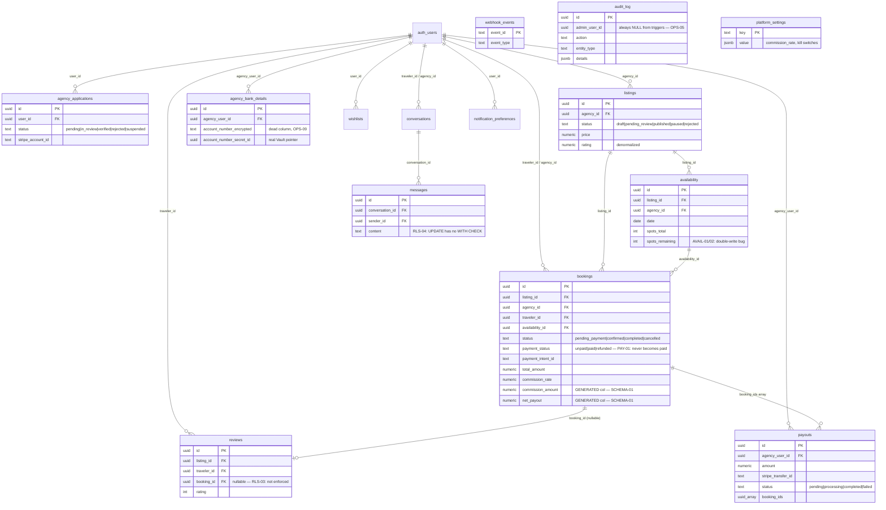
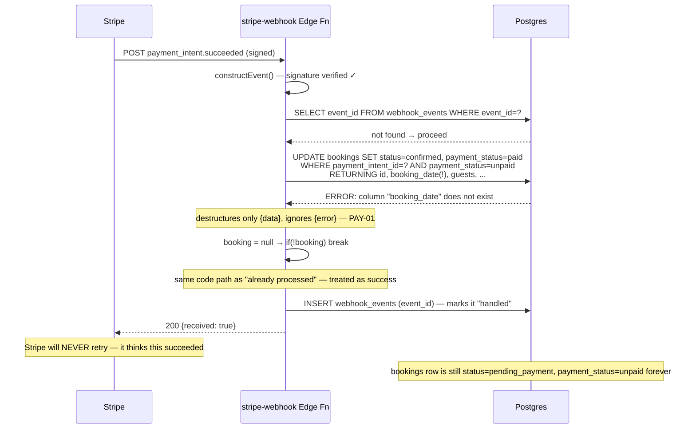
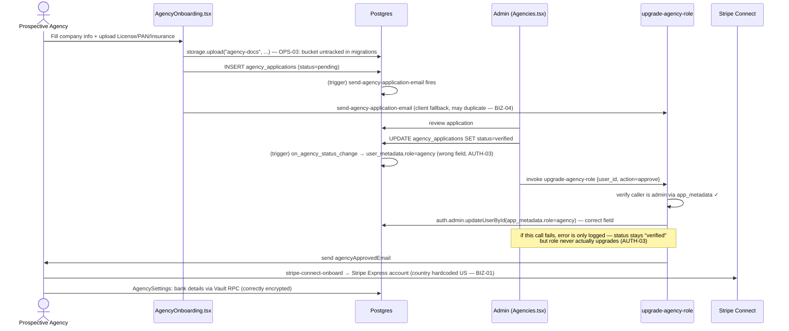
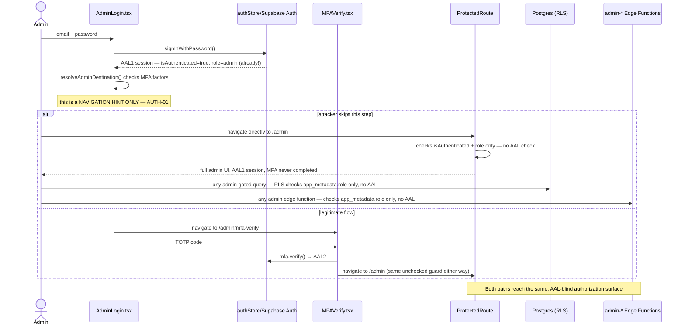

# Nepal Travel Hub — Production Readiness Audit

**Scope:** full repository at `/Users/kelennn/Desktop/startup/nepal-travel-hub` — frontend (`src/`), all 35 loose SQL migration files (`supabase/*.sql` + root `supabase_*.sql`), all 13 Supabase Edge Functions + 5 shared modules, RLS policies, Stripe integration, auth/role model, and project docs (`README.md`, `MIGRATION_ORDER.md`, `.env.example`).

**Method:** static, read-only review. No code was modified, no database was queried live, no commands beyond read-only `git`/`grep`/`find`/`cat` were run. Every finding below cites an exact file and line and quotes the relevant code; several are further confirmed by tracing the call chain end-to-end (e.g. PAY-01 is traced from the SQL trigger through the edge function through the exact frontend polling loop that surfaces it to a user) or by checking `git blame`/`git log` to establish how long a bug has existed. Where a claim could not be verified from files alone (e.g. "what does the live database's schema actually look like right now"), it is explicitly flagged as **NEEDS LIVE-DB VERIFICATION** rather than assumed.

**Bottom line:** this codebase has clearly been through real, competent security-hardening work — there is a documented history of pen-test-style fixes (role escalation, RLS tightening, financial-field locking, Vault-based bank-detail encryption, webhook idempotency, atomic availability claims) with unusually good commit/comment hygiene explaining *why* each fix exists. But it is **not production-ready**. The single most important finding (PAY-01) means, as currently written, **a customer can be successfully charged by Stripe and still end up with no valid booking**, because of one wrong column name in the webhook handler — and this has been broken since the file's first commit. Two more P0s mean **any logged-in user can read the platform's revenue/commission dashboard data** and, on at least one table, **self-escalate to admin**. None of this is visible from the UI, which looks and behaves like a working product — which is exactly why this audit was necessary.

---

## Summary

| Severity | Count | Meaning |
|---|---|---|
| **P0** | 9 | Breaks or is exploitable in production right now; blocks launch |
| **P1** | 17 | Real bug or real vulnerability, not immediately catastrophic, must fix before scaling |
| **P2** | 15 | Quality/consistency/operability issue |
| **P3** | 10 | Cleanup / cosmetic / low-risk |

Finding ID prefixes: `PAY-*` payments, `AVAIL-*` availability/inventory, `SCHEMA-*` schema/migration integrity, `RLS-*` row-level security, `AUTH-*` authentication/authorization, `BIZ-*` business logic duplication, `FE-*` frontend, `OPS-*` operations/process, `SEC-*` general security.

---

## P0 — Critical (blocks launch)

### PAY-01 — Stripe webhook selects a nonexistent column; every successful payment silently fails to confirm the booking, which is then auto-cancelled while the customer stays charged

- **Severity:** P0
- **File:** `supabase/functions/stripe-webhook/index.ts:55-66`
- **Function/component:** `payment_intent.succeeded` handler in the Stripe webhook Edge Function
- **Current behavior:**
  ```ts
  const { data: booking } = await supabaseAdmin
    .from("bookings")
    .update({ status: "confirmed", payment_status: "paid" })
    .eq("payment_intent_id", pi.id)
    .eq("payment_status", "unpaid")
    .select(`
      id,
      booking_date,      // <-- this column does not exist
      guests,
      total_amount,
      net_payout,
      ...
    `)
    .maybeSingle();

  if (!booking) break; // already confirmed — do not resend emails
  ```
  The `bookings` table (defined in `supabase_bookings_migration.sql:28`) has a column named **`trip_date`**, not `booking_date`. `booking_date` does not exist anywhere in the schema — confirmed by grepping the entire repository; the only three occurrences of the string `booking_date` in the whole codebase are this file's own `.select()` and the two places it destructures `booking.booking_date` a few lines later (lines 98, 120). `git log -L` shows this column name has been wrong since the very first commit that created this file (`7952a8b`, 2026-04-11) and survived a later "fintech hardening" pass (`d89cdce`, 2026-06-03) that added idempotency and the `webhook_events` table — nobody caught it.

  Because `RETURNING`/`.select()` is part of the same SQL statement as the `UPDATE`, selecting a nonexistent column makes the **entire UPDATE fail** (Postgres error: `column "booking_date" does not exist`), not just the returned representation. The Supabase JS client only destructures `data` here (`const { data: booking } = ...`), **discarding the `error` entirely**. `data` comes back `null`, and `if (!booking) break;` — the exact same code path used for "this event was already processed" — silently treats a hard SQL failure as a no-op.
- **Why it is dangerous:** This is not a theoretical race condition — it is a 100%-reproducible, unconditional bug that fires on every single successful card payment. Traced end-to-end:
  1. Customer pays via Stripe Elements (`BookingPayment.tsx`) → Stripe genuinely charges the card and returns `paymentIntent.status === "succeeded"`.
  2. Stripe sends `payment_intent.succeeded` to the webhook → the UPDATE above fails silently → `bookings.status` stays `pending_payment`, `payment_status` stays `unpaid`.
  3. The webhook still records the event in `webhook_events` (line ~163) and returns `200 { received: true }` to Stripe — so **Stripe considers the webhook delivered and will never retry it**. There is no self-healing path.
  4. The frontend (`src/pages/BookingPayment.tsx:48-84`) polls `bookings.payment_status` every 2s for 15 attempts (30s) waiting for it to become `"paid"`. It never does. After 30s it shows: *"Payment received but confirmation is taking longer than expected. You'll receive an email shortly."* — and navigates to the confirmation page **regardless of the poll result** (line 77-81, unconditional).
  5. `src/pages/BookingConfirmation.tsx` fetches the booking and renders a "confirmed" UI without ever branching on `payment_status` (`grep "payment_status" BookingConfirmation.tsx` shows the field is fetched at line 76 and never checked again) — so the customer sees a normal-looking confirmation page for a booking that is not actually confirmed.
  6. No confirmation email is sent (the email code is inside the same dead branch), and no agency-notification email is sent either.
  7. `supabase/functions/reap-stale-bookings/index.ts` runs every 15 minutes via `pg_cron` and cancels any booking still `pending_payment`/`unpaid` after **1 hour**. This booking qualifies. It gets silently cancelled — **while the money is sitting captured in Stripe with no refund issued.**
  Net effect: the customer is charged, sees a plausible-looking success page, gets no email, and within an hour their booking vanishes from the system with no refund and no alert to anyone. This is the worst possible failure mode for an OTA — a real money/trust incident, not just a bug.
- **Recommended architecture:** Never destructure only `data` from a Supabase client call whose result matters — always check `error` and handle/log it (ideally send to an error-monitoring service; see OPS-02). More specifically, the webhook handler's DB write must be resilient to unexpected schema drift and must alert loudly on failure rather than falling through to the "already processed" branch.
- **Suggested fix (direction, not applied):** (1) Change `booking_date` to `trip_date` in the `.select()` (matches the real column). (2) Change the destructure to `const { data: booking, error } = await ...` and `if (error) { logError(...); return new Response("DB update failed", { status: 500 }); }` — a 500 makes Stripe retry, which is exactly the safety net this needs. (3) Add an integration test (see below) that asserts a `payment_intent.succeeded` event actually flips `payment_status` to `paid`. (4) Manually reconcile: query Stripe for all `succeeded` PaymentIntents and cross-reference against `bookings.payment_status='paid'` to find and manually fix any customers already affected by this in whatever environment has been live.
- **Database impact:** None structurally — just needs the correct column name.
- **API/backend impact:** `supabase/functions/stripe-webhook/index.ts` must be fixed and redeployed; recommend adding the same error-checking pattern to `payment_intent.payment_failed` and `charge.refunded` handlers in the same file, which *do* check `error` correctly today but would benefit from the same alerting.
- **Frontend impact:** None required for the fix itself, but `BookingPayment.tsx`'s poll-timeout branch (line 77-81) and `BookingConfirmation.tsx` should stop treating "poll timed out" as equivalent to success — show a genuine "we're verifying your payment, don't worry, contact support with this reference if it doesn't update" state instead of silently proceeding.
- **Testing requirement:** An integration test that posts a real (test-mode) Stripe webhook payload for `payment_intent.succeeded` against a seeded `pending_payment` booking and asserts the row becomes `confirmed`/`paid` would have caught this on day one. This is the single highest-value test to add to this codebase (see OPS-01).

---

### AVAIL-01 — Every booking with an availability slot decrements `spots_remaining` twice (stale trigger never retired)

- **Severity:** P0
- **File:** `supabase_bookings_migration.sql:166-201` (old trigger, never dropped) vs. `supabase/availability_spot_tracking.sql:18-35` (new atomic RPC) vs. call site `supabase/functions/create-payment-intent/index.ts:85-99`
- **Function/component:** `on_booking_insert_decrement_spots()` trigger + `claim_availability_spots()` RPC
- **Current behavior:** `supabase_bookings_migration.sql` creates `trg_booking_insert_decrement` (`AFTER INSERT ON bookings`), which runs:
  ```sql
  UPDATE public.availability
  SET spots_remaining = GREATEST(spots_remaining - NEW.guests, 0)
  WHERE id = NEW.availability_id;
  ```
  whenever a non-cancelled booking with an `availability_id` is inserted. Months later, `supabase/availability_spot_tracking.sql` was added specifically to fix a race condition in this exact area (its own header comment: *"spots_remaining is never decremented on booking... Fix: an atomic claim function"*) via a new RPC, `claim_availability_spots(p_availability_id, p_guests)`, which does an atomic `UPDATE ... WHERE spots_remaining >= p_guests`. `create-payment-intent/index.ts:90-96` correctly calls this RPC **before** inserting the booking row:
  ```ts
  const { error: claimError } = await supabaseAdmin.rpc("claim_availability_spots", {
    p_availability_id: availability_id, p_guests: guests,
  });
  ...
  // ...then later, still in the same request:
  await supabaseAdmin.from("bookings").insert({ ...., availability_id: availability_id || null });
  ```
  Because the booking INSERT still has `availability_id` set and `status` defaults to `"pending_payment"` (not `"cancelled"`), **the old `trg_booking_insert_decrement` trigger also fires on this same INSERT** — nobody ever added `DROP TRIGGER trg_booking_insert_decrement ON public.bookings;` anywhere in the 35-file migration set (confirmed via repo-wide grep for the trigger/function name — the only hits are its own creation).
- **Why it is dangerous:** Every single booking now decrements `availability.spots_remaining` **twice**: once via the atomic RPC claim (correct, race-safe), once again via the leftover AFTER INSERT trigger (redundant, and the two decrements aren't even coordinated — the trigger doesn't know the RPC already ran). This directly undermines the entire point of `availability_spot_tracking.sql` — listings will show as sold out roughly twice as fast as their real capacity, denying legitimate bookings on genuinely-available dates. At scale this is a customer-facing correctness bug that looks like "our best listings keep going unavailable," which is very hard to diagnose without reading both triggers side-by-side.
- **Recommended architecture:** Availability accounting should have exactly one write path per lifecycle event (claim on create, restore on cancel), enforced via the atomic RPC functions only — no AFTER INSERT/UPDATE trigger should also mutate `spots_remaining`.
- **Suggested fix (direction):** `DROP TRIGGER trg_booking_insert_decrement ON public.bookings; DROP FUNCTION on_booking_insert_decrement_spots();` in a new migration, after confirming (via AVAIL-02 below) the cancel-side trigger is dropped in the same pass.
- **Database impact:** One `DROP TRIGGER` + `DROP FUNCTION` migration. Needs a data-repair pass first — live `availability.spots_remaining` values are likely already wrong (too low) for any listing that has taken bookings; recompute from `spots_total` minus the sum of active (non-cancelled) bookings' `guests` per `availability_id`.
- **API/backend impact:** None beyond the migration — `create-payment-intent`'s own logic doesn't need to change, it's already correct.
- **Frontend impact:** None directly, but availability-display bugs reported by agencies/travelers ("it said sold out but wasn't") are a likely symptom already in production.
- **Testing requirement:** A test that creates a booking against a known `spots_total`/`spots_remaining` fixture and asserts `spots_remaining` decreases by exactly `guests` (not `2 × guests`).

---

### AVAIL-02 — Every cancellation restores `spots_remaining` twice (same stale-trigger pattern, opposite direction — real overselling risk)

- **Severity:** P0
- **File:** `supabase_bookings_migration.sql:178-208` (old trigger `trg_booking_cancel_restore`, never dropped) vs. `supabase/availability_spot_tracking.sql:51-68` (new `trg_restore_availability_on_cancel`)
- **Function/component:** `on_booking_cancel_restore_spots()` + `restore_availability_on_cancel()`, both `AFTER UPDATE ON bookings`
- **Current behavior:** Exactly the same pattern as AVAIL-01, mirrored for cancellation. Both `trg_booking_cancel_restore` (original) and `trg_restore_availability_on_cancel` (from `availability_spot_tracking.sql`) are live, unconditional `AFTER UPDATE` triggers that both fire whenever a booking transitions into `status = 'cancelled'`. Both run `UPDATE availability SET spots_remaining = LEAST(spots_remaining + guests, spots_total) WHERE id = availability_id`, and — critically — Postgres fires all matching triggers on a row **in sequence, within the same transaction**, so the second trigger reads the `spots_remaining` value the first trigger already wrote and adds `guests` again on top of it. Confirmed live call sites that trigger this: `supabase/functions/cancel-booking/index.ts` and `supabase/functions/process-refund/index.ts` both just do `.update({ status: "cancelled", ... })` and rely entirely on DB triggers to restore spots — neither calls `release_availability_spots` manually, so there is no code path that avoids the double-fire.
- **Why it is dangerous:** Unlike AVAIL-01 (which only makes listings look *more* full than they are — annoying but safe), this bug makes `spots_remaining` **too high**, which is a genuine overselling risk: a listing can show more available spots than physically exist, letting more travelers book a date than the agency can actually accommodate. Combined with AVAIL-01's double-decrement, the two bugs partially mask each other on average but do **not** cancel out reliably (they depend on independent sequences of bookings vs. cancellations for the same date), so `spots_remaining` drifts unpredictably from ground truth over time regardless.
- **Recommended architecture / Suggested fix:** Same as AVAIL-01 — drop the old trigger and function (`trg_booking_cancel_restore` / `on_booking_cancel_restore_spots`) in the same cleanup migration, keeping only `trg_restore_availability_on_cancel`.
- **Database impact:** Same migration as AVAIL-01; same need for a one-time data-repair recompute of `spots_remaining` across all availability rows.
- **API/backend impact:** None — `cancel-booking`/`process-refund` are already written correctly (relying on exactly one trigger, which is the right design once the duplicate is removed).
- **Frontend impact:** None directly.
- **Testing requirement:** A test that cancels a booking and asserts `spots_remaining` increases by exactly `guests` (not `2 × guests`), capped at `spots_total`.

---

### SCHEMA-01 — `commission_amount`/`net_payout` are declared `GENERATED ALWAYS AS (...) STORED` in the original schema, but the booking-creation code explicitly inserts values into them — this cannot work in Postgres unless the live schema has silently drifted from every checked-in migration

- **Severity:** P0
- **File:** `supabase_bookings_migration.sql:36-42` (column definitions) vs. `supabase/functions/create-payment-intent/index.ts:151-153` (insert)
- **Function/component:** `bookings` table definition vs. booking-creation insert
- **Current behavior:** The original migration declares:
  ```sql
  commission_amount NUMERIC(10,2) GENERATED ALWAYS AS (total_amount * commission_rate / 100) STORED,
  net_payout        NUMERIC(10,2) GENERATED ALWAYS AS (total_amount - (total_amount * commission_rate / 100)) STORED,
  ```
  `GENERATED ALWAYS ... STORED` columns are computed by Postgres itself and **cannot be given an explicit value in an INSERT or UPDATE** — PostgreSQL raises `ERROR: cannot insert into column "commission_amount" / column is a generated column` if you try. Yet `create-payment-intent/index.ts` does exactly that:
  ```ts
  .insert({
    ...,
    commission_rate: commissionRate,
    commission_amount: commissionAmt,   // explicit value into a GENERATED ALWAYS column
    net_payout: netPayout,              // same
    ...
  })
  ```
  I grepped every SQL file in the repository for `GENERATED` and for `commission_amount`/`net_payout` column-definition changes — there is **no** `ALTER TABLE ... ALTER COLUMN ... DROP EXPRESSION` (the correct way to un-generate a column) or any other migration that changes this. The only place these columns are (re)defined is the original migration.
- **Why it is dangerous:** One of two things must be true, and both are serious:
  1. **Booking creation is currently broken end-to-end** on any database built strictly from the checked-in migration files — the INSERT above would fail outright on a fresh setup, meaning nobody could ever create a booking. This directly contradicts observed evidence that bookings do exist (a test booking was visible during unrelated work on this repo), so...
  2. ...more likely, **the live database's actual schema no longer matches what's checked into this repository** — someone manually ran `ALTER TABLE bookings ALTER COLUMN commission_amount DROP EXPRESSION` (or recreated the columns as plain columns) directly against the live database, and that change was never captured in a migration file. This is a disaster-recovery risk: if the live database were ever lost and rebuilt strictly from these files, booking creation would not work, and nobody would know why without independently rediscovering this exact issue.
  Either way, this is squarely in "the migration files cannot be trusted to reconstruct the live schema" territory — the single most important property a migration set needs to have for a financial system.
- **Recommended architecture:** The checked-in migrations must be the single source of truth for schema. Dump the actual live schema (`pg_dump --schema-only`, or `supabase db dump`) and reconcile it against every file in this repo, then move to a real, ordered migration system (see OPS-04) so this can never silently happen again.
- **Suggested fix (direction):** After confirming against the live DB which state is correct, either (a) add a migration that formally drops the GENERATED expression on both columns (if the live DB still has them generated and booking creation is in fact currently broken), or (b) if the live DB already has them as plain columns, add a migration that documents/replays that exact change so the repo matches reality.
- **Database impact:** Schema-defining migration, high-consequence — must be tested against a copy of production data first.
- **API/backend impact:** None if the live DB already matches what the edge function expects; otherwise `create-payment-intent` is dead-on-arrival until this is fixed.
- **Frontend impact:** None directly.
- **Testing requirement:** A test that actually inserts a booking row via the real schema (not mocked) — this alone would immediately surface whether this is live-broken.
- **NEEDS LIVE-DB VERIFICATION:** run `\d+ bookings` (or `SELECT column_name, is_generated FROM information_schema.columns WHERE table_name='bookings'`) against the actual production database and compare to this file before doing anything else.

---

### RLS-01 — Four `SECURITY DEFINER` admin analytics RPCs have zero internal authorization check and are `GRANT`ed to every authenticated user — any traveler or agency can read platform-wide revenue and commission data

- **Severity:** P0
- **File:** `supabase/admin_dashboard_rpc.sql:1-84` (full file)
- **Function/component:** `admin_booking_stats`, `admin_revenue_by_month`, `admin_agency_signups`, `admin_bookings_by_category` (all SQL functions), consumed by `src/pages/admin/Dashboard.tsx`
- **Current behavior:**
  ```sql
  CREATE OR REPLACE FUNCTION public.admin_booking_stats(start_date DATE, end_date DATE)
  RETURNS TABLE(period DATE, booking_count BIGINT, total_revenue NUMERIC, total_commission NUMERIC)
  AS $$ SELECT ... FROM public.bookings WHERE ... AND payment_status = 'paid' GROUP BY period ORDER BY period; $$
  LANGUAGE sql STABLE SECURITY DEFINER;
  ...
  GRANT EXECUTE ON FUNCTION public.admin_booking_stats TO authenticated;
  GRANT EXECUTE ON FUNCTION public.admin_revenue_by_month TO authenticated;
  GRANT EXECUTE ON FUNCTION public.admin_agency_signups TO authenticated;
  GRANT EXECUTE ON FUNCTION public.admin_bookings_by_category TO authenticated;
  ```
  All four functions are `SECURITY DEFINER` (they run with the privileges of the function owner and therefore **bypass RLS entirely**) and contain no role check whatsoever in their bodies — no `IF (auth.jwt()->'app_metadata'->>'role') <> 'admin' THEN RAISE EXCEPTION` guard, nothing. They are `GRANT`ed to the entire `authenticated` Postgres role, i.e. every signed-in user of the app, not just admins.
- **Why it is dangerous:** Any logged-in traveler or agency account can open the browser console and call `supabase.rpc('admin_booking_stats', { start_date: '2020-01-01', end_date: '2030-01-01' })` (or the other three) directly and receive platform-wide booking counts, total revenue, total commission by period, agency signup counts, and bookings-by-category breakdowns — exactly the business intelligence meant to be admin-dashboard-only. There is no authentication barrier beyond "has an account," which anyone can create for free. This is a straightforward, trivially exploitable business-data disclosure with real competitive/financial sensitivity (revenue and commission figures).
- **Recommended architecture:** `SECURITY DEFINER` functions that bypass RLS must always perform their own authorization check as the very first statement in the function body, or must not be reachable by non-privileged roles at all.
- **Suggested fix (direction):** Add `IF (auth.jwt()->'app_metadata'->>'role') IS DISTINCT FROM 'admin' THEN RAISE EXCEPTION 'Admin access required'; END IF;` at the top of each of the four function bodies, **or** `REVOKE EXECUTE ON FUNCTION ... FROM authenticated, anon, PUBLIC` and only ever call these from a service-role-authenticated edge function that independently re-verifies the caller is admin (consistent with every other admin action in this codebase).
- **Database impact:** Four `CREATE OR REPLACE FUNCTION` statements adding the guard (or four `REVOKE` statements), no schema change.
- **API/backend impact:** None if the guard-in-function approach is used (frontend `admin/Dashboard.tsx` keeps calling `.rpc()` directly); if moved behind an edge function, `admin/Dashboard.tsx` needs a small refactor to call it instead of `supabase.rpc()` directly.
- **Frontend impact:** Only if the fix moves these behind an edge function (see above).
- **Testing requirement:** A test that calls each of the four RPCs as a non-admin authenticated user and asserts it is rejected.

---

### AUTH-01 — MFA/TOTP for admin accounts is enforced only by a client-side navigation hint; nothing (route guard, RLS, or edge function) checks the session's authentication-assurance level, so it is fully bypassable

- **Severity:** P0
- **File:** `src/components/auth/ProtectedRoute.tsx:9-35`, `src/lib/roleRedirect.ts:23-32`, and — critically — every RLS policy and edge function that gates on `app_metadata.role='admin'` anywhere in the codebase
- **Function/component:** Admin authentication flow end-to-end
- **Current behavior:** After `supabase.auth.signInWithPassword()` succeeds with correct admin credentials, Supabase issues a fully valid session/JWT at **AAL1** (password only, before any TOTP challenge). `src/stores/authStore.ts`'s `signIn()` immediately sets `isAuthenticated: true, user.role: "admin"` from that AAL1 session — the app already considers the user a fully authenticated admin at this point. `AdminLogin.tsx` then calls `navigate(await resolveAdminDestination())`, which (`roleRedirect.ts`) checks `supabase.auth.mfa.listFactors()` and sends the browser to `/admin/mfa-verify` if no verified factor exists yet — but this is **purely a client-side navigation choice**. `ProtectedRoute.tsx` (the actual route guard) only checks:
  ```ts
  if (!isAuthenticated || !user) { /* redirect to login */ }
  if (allowedRoles && !allowedRoles.includes(user.role)) { /* redirect */ }
  return <Outlet />;
  ```
  — no AAL/MFA check anywhere. A repo-wide grep for `aal`/`AuthenticatorAssuranceLevel` (case-insensitive) across `src/` and `supabase/` returns **zero matches** outside `roleRedirect.ts`'s advisory use.
- **Why it is dangerous:** An attacker with valid admin credentials but without the TOTP device (phished password, credential-stuffing hit, leaked `.env`/password manager, etc.) can sign in, and the moment `signIn()` resolves — before ever completing MFA — simply navigate the browser directly to `/admin` (or call the app's own Supabase queries/edge functions directly) instead of letting the app redirect them to the MFA challenge screen. `ProtectedRoute` has nothing to stop this. Worse, this is not just a client-routing gap: **every RLS policy** that checks `(auth.jwt()->'app_metadata'->>'role')='admin'` and **every edge function** that checks `caller.app_metadata?.role !== 'admin'` (i.e. essentially all backend admin authorization in this app) also never checks the JWT's `aal` claim. The AAL1 session obtained immediately after password login already carries full admin authorization for every backend call in the system, not just the SPA's own routes. As implemented, admin TOTP is UI-only routing, not a real second factor.
- **Recommended architecture:** Authentication-assurance level must be checked wherever admin authorization is checked — in RLS policies (Supabase/Postgres supports `(auth.jwt()->>'aal') = 'aal2'` conditions) and in every admin-gated edge function, not just as a client-side redirect hint.
- **Suggested fix (direction):** Add an `aal2` requirement to every admin RLS policy and every edge function's admin check (e.g. `caller.app_metadata?.role !== 'admin' || (caller as any).aal !== 'aal2'`, or decode the JWT's `aal` claim server-side), for any account that has a verified TOTP factor enrolled. Additionally, `ProtectedRoute.tsx` should re-check the session's AAL on every route transition (not just immediately post-login) and redirect to `/admin/mfa-verify` if it's not at the required level.
- **Database impact:** RLS policy updates on every admin-gated table (`agency_applications`, `bookings`, `listings`, `payouts`, `agency_bank_details`, `audit_log`, `profiles`, `reviews`, `platform_settings`).
- **API/backend impact:** Every edge function with an admin check (`admin-users`, `upgrade-agency-role`, `process-payout`) needs the additional AAL check.
- **Frontend impact:** `ProtectedRoute.tsx` needs an AAL check on every navigation, not just post-login.
- **Testing requirement:** A test that signs in as an admin, does **not** complete the TOTP challenge, and asserts that both a direct RLS query and a direct edge-function call are rejected.

---

### RLS-02 — `listings` table's admin RLS policies were never migrated off the client-editable `user_metadata` field — a standing, standalone, currently-unpatched self-escalation vector

- **Severity:** P0
- **File:** `supabase_listings_migration.sql:118-132`
- **Function/component:** `admins_select_all_listings` / `admins_update_all_listings` RLS policies on `public.listings`
- **Current behavior:**
  ```sql
  CREATE POLICY "admins_select_all_listings" ON public.listings
    FOR SELECT USING ((auth.jwt() -> 'user_metadata' ->> 'role') = 'admin');
  CREATE POLICY "admins_update_all_listings" ON public.listings
    FOR UPDATE USING ((auth.jwt() -> 'user_metadata' ->> 'role') = 'admin');
  ```
  This codebase has a well-documented, deliberate security fix (`supabase/fix_security_use_app_metadata.sql`) that moved admin-role checks from `user_metadata` (client-editable via `supabase.auth.updateUser({ data: {...} })`) to `app_metadata` (server/service-role-only) across **eight** tables: `agency_applications`, `bookings`, `payouts`, `agency_bank_details`, `audit_log`, `profiles`, `reviews`, `platform_settings`. I read that migration in full and confirmed it does exactly what it claims for those eight tables. **`listings` is not among them** — there is no section for it in that file, and a repo-wide grep confirms no other file ever fixes `admins_select_all_listings`/`admins_update_all_listings`.
- **Why it is dangerous:** `user_metadata` is directly settable by any authenticated user via the client SDK: `supabase.auth.updateUser({ data: { role: "admin" } })`. Because `listings`' admin policies were missed by the otherwise-thorough app_metadata migration, **any signed-in user can self-grant this specific check today** by calling that one line from the browser console, and their next request will pass `admins_select_all_listings`/`admins_update_all_listings`. This grants: read access to every listing regardless of status (including competitors' `draft`/`pending_review`/`rejected` listings — real, sensitive, unpublished business data), and write access to update any listing (change price, mark as `featured`, change `status` to `published`, or deface a competitor's listing).
- **Recommended architecture / Suggested fix:** Add `listings` as a ninth section to (or a small standalone follow-up of) `fix_security_use_app_metadata.sql`: `DROP POLICY IF EXISTS "admins_select_all_listings" ...; CREATE POLICY ... USING ((auth.jwt()->'app_metadata'->>'role')='admin'); ` and the same for the UPDATE policy.
- **Database impact:** Two `DROP POLICY` + `CREATE POLICY` statements, no schema change, safe/idempotent if written with `DROP POLICY IF EXISTS`.
- **API/backend impact:** None.
- **Frontend impact:** None.
- **Testing requirement:** A test that sets a non-admin user's own `user_metadata.role` to `"admin"` via the client SDK and asserts they still cannot read/update another agency's non-published listing.
- **Related/broader pattern (downgraded to P1, see AUTH-07):** nine *other* files (`schema.sql`, `audit_log_migration.sql`, `payouts_migration.sql`, `platform_settings_migration.sql`, `admin_reviews_migration.sql`, `lock_booking_financial_fields.sql`, `admin_bookings_policy.sql`, `bank_details_migration.sql`, `fix_admin_profiles_policy.sql`) still contain the same vulnerable `user_metadata` pattern in their own source text — but each of those is correctly superseded by name-matching `DROP POLICY IF EXISTS` + recreate logic in `fix_security_use_app_metadata.sql`, which (by file modification time) is the newest file in the set. **If** migrations were applied in creation order (the workflow this repo's docs describe), those eight are currently safe in practice — but the repo has no enforced migration ordering, so replaying any of those nine files individually (e.g. rebuilding a dev database) silently reintroduces the vulnerability. This process risk is tracked separately as **AUTH-07** in the P1 section, since it is a different kind of risk (operational/process) from `listings`' standalone, currently-live gap.

---

### RLS-03 — Reviews can be inserted for any listing without any real "completed booking" verification at the database level — the eligibility check exists only in frontend/store code, not in RLS

- **Severity:** P0
- **File:** `supabase/schema.sql:24-27` (canonical `reviews_traveler_insert` policy, matches what's live per `review_helpful_fn.sql:20-27`'s recreation of the same policy)
- **Function/component:** `reviews` table INSERT policy vs. `useCanReviewListing`/`useSubmitReview` (`src/lib/queries.ts`) and `checkCanReview` (`src/stores/reviewsStore.ts`, dead code — see FE-04)
- **Current behavior:**
  ```sql
  CREATE POLICY "reviews_traveler_insert" ON reviews
    FOR INSERT WITH CHECK (auth.uid() = traveler_id);
  ```
  This is the entire server-side gate on who can write a review. Compare to the frontend, which does real eligibility checking — `useCanReviewListing` and `useSubmitReview` in `src/lib/queries.ts` both require a `bookings` row with `status = 'completed'` for that listing/traveler before allowing the review UI to render or submit. But that logic lives entirely in application code, not in the `WITH CHECK` clause that actually decides whether the INSERT is allowed.
- **Why it is dangerous:** Any authenticated user can call `supabase.from("reviews").insert({...})` directly — bypassing the React UI/hooks entirely — with an arbitrary `listing_id` (including listings from a competitor agency, or listings they've never even viewed), no `booking_id` (it's nullable, `ON DELETE SET NULL`), and any `rating`/`title`/`comment`. The only requirement enforced by the database is that `traveler_id` matches the caller. This means the "Verified" badge shown on reviews throughout the app is not actually backed by any real completed-booking guarantee at the data layer — it's cosmetic, trivially forgeable review-bombing (positive, to inflate a colluding listing, or negative, to sabotage a competitor).
- **Recommended architecture:** Eligibility rules that determine whether a financially/reputationally significant row can be written must be enforced in the database's `WITH CHECK`, not only in application code that a client can bypass by calling the API directly.
- **Suggested fix (direction):** Tighten the INSERT policy to require a real, owned, completed booking for the same listing:
  ```sql
  WITH CHECK (
    auth.uid() = traveler_id
    AND EXISTS (
      SELECT 1 FROM bookings b
      WHERE b.id = reviews.booking_id
        AND b.traveler_id = auth.uid()
        AND b.listing_id = reviews.listing_id
        AND b.status = 'completed'
    )
  )
  ```
- **Database impact:** One `DROP POLICY IF EXISTS` + `CREATE POLICY` on `reviews`.
- **API/backend impact:** None — `useSubmitReview` already supplies a real `booking_id` when used correctly through the UI, so legitimate traffic is unaffected.
- **Frontend impact:** None required, though this is a good opportunity to also fix the dead-code duplication noted in FE-04 (`reviewsStore.ts`'s parallel, unused `checkCanReview` implementation).
- **Testing requirement:** A test that attempts to insert a review with no completed booking (or someone else's booking) and asserts it is rejected by RLS.

---

## P1 — High priority

Findings in this tier are real bugs or real vulnerabilities but with lower blast radius, lower exploitability, or lower immediate financial risk than the P0s above. Full detail retained where the finding is non-obvious; more compact where the fix direction is self-evident.

### PAY-02 — `cancel-booking` and `process-refund` duplicate the same cancellation/refund business logic with diverging guard conditions

- **File:** `supabase/functions/cancel-booking/index.ts` vs. `supabase/functions/process-refund/index.ts`
- **Current behavior:** Both functions independently implement: fetch booking → authorize (traveler-owns-it or admin) → compute a refund tier from days-until-trip (100% ≥7 days, 50% ≥3 days, else 0%) → call `stripe.refunds.create()` with idempotency key `refund_${booking.id}` → update `status`/`payment_status`. But their guard conditions differ: `process-refund` explicitly requires `booking.status === "confirmed"` (rejects `pending_payment` and, importantly, `completed`); `cancel-booking` only rejects `status === "cancelled"` — it has **no check preventing cancellation of a `completed` trip**. In practice the refund-tier math (based on `trip_date`, which is in the past for a completed trip) makes the financial exploit unlikely (`daysUntilTrip` would be deeply negative → 0% refund), but a completed booking can still be flipped back to `cancelled`, corrupting historical records and potentially interfering with review eligibility (RLS-03's fix depends on `status='completed'` staying meaningful).
- **Why it matters:** This is exactly the "duplicate business logic" anti-pattern that's dangerous by construction — two independent implementations of the same rule will drift, as they already have. A future change to refund policy applied to one function and not the other creates an inconsistency an attacker (or just a confused support agent) can exploit by choosing whichever endpoint is more permissive.
- **Suggested fix:** Consolidate into one function (or have `cancel-booking` call the same shared helper `process-refund` uses), and add the missing `status !== 'completed'` guard to `cancel-booking`.
- **Database impact:** None. **API impact:** merge/refactor two edge functions. **Frontend impact:** confirm which one the UI actually calls (`MyBookings.tsx`) and remove the dead one. **Testing:** a test asserting a `completed` booking cannot be cancelled via either path.

### BIZ-01 — Agency Stripe Connect accounts are hardcoded to `country: "US"` for a Nepal-based marketplace

- **File:** `supabase/functions/stripe-connect-onboard/index.ts:57` — `country: "US", // use "NP" once Nepal is supported in production`
- **Why it matters:** This is a real compliance/tax question, not just a code smell — Nepali agencies are being onboarded to Stripe as if they were US business entities. Stripe Connect does not support Nepal as a payout country as of this writing, which may be *why* this workaround exists, but it needs explicit legal/finance sign-off (tax residency, terms-of-service accuracy, KYC document mismatch between a Nepali business and a "US company" Stripe account type) before this goes further, not just a code comment.
- **Suggested fix:** Confirm with legal/finance whether this is an accepted interim approach or needs a different payout mechanism (e.g. Stripe's cross-border/Recipient options, Wise, or a manual bank-transfer payout path — `agency_bank_details`/Vault infrastructure already exists for this, see MISC-11 in the original sub-report).

### AUTH-02 (renumbered `RLS-04` for consistency) — Messages table UPDATE policy has no `WITH CHECK`; any conversation participant can rewrite any message's content or sender

- **File:** `supabase/messaging_migration.sql:53-56`
  ```sql
  CREATE POLICY "users_update_read_status" ON public.messages
    FOR UPDATE USING (
      EXISTS (SELECT 1 FROM public.conversations c WHERE c.id = conversation_id AND auth.uid() IN (c.traveler_id, c.agency_id))
    );
  ```
- **Why it matters:** No `WITH CHECK` means Postgres reuses the `USING` clause as the check, so any participant can `UPDATE` **any column** of **any message** in a conversation they're part of — not just `read_at` (which is all the app's own UI ever sets). A participant could rewrite the *other* party's message content after the fact, or reassign `sender_id`, which is a tampering/impersonation vector within a conversation thread. This is exactly the bug class `fix_booking_rls.sql` and `fix_agency_application_rls.sql` were written to close elsewhere in this same codebase — it was missed here.
- **Suggested fix:** Add a `WITH CHECK` (or a `lock_booking_financial_fields`-style BEFORE UPDATE trigger) that only allows `read_at` to change, and only by the participant who is *not* the message's sender.

### SEC-01 — `get_user_display_names` RPC leaks arbitrary users' email addresses; no ownership/participant check, default-granted to all authenticated users

- **File:** `supabase/messaging_migration.sql:94-101`, called from `src/hooks/useMessages.ts:101`
  ```sql
  CREATE OR REPLACE FUNCTION public.get_user_display_names(user_ids UUID[])
  RETURNS TABLE(id UUID, display_name TEXT)
  LANGUAGE sql SECURITY DEFINER AS $$
    SELECT id, COALESCE(raw_user_meta_data->>'name', email) AS display_name
    FROM auth.users WHERE id = ANY(user_ids);
  $$;
  ```
- **Why it matters:** No `GRANT`/`REVOKE` statement follows this in the file, so it keeps Postgres's default EXECUTE privilege. It performs no check that the caller shares a conversation (or any relationship) with the requested `user_ids`. Since UUIDs for travelers/agencies are already visible in other public API responses across the app (booking `traveler_id`, listing `agency_id`, review `traveler_id`, etc.), any authenticated caller can harvest the real email address of any user who hasn't set a display name (`COALESCE(name, email)` falls through to raw email) — a user-enumeration/PII-disclosure primitive independently confirmed by two separate sub-audits in this review.
- **Suggested fix:** Scope the query to only IDs that are participants in a conversation the caller is part of, and never fall back to raw email in a broadly-callable function — return a generic label like "User" instead.

### AUTH-03 — `role_upgrade_trigger.sql`'s `on_agency_status_change` trigger is still live and writes the agency role into the wrong (client-writable) metadata field, and the edge-function step that writes the *correct* field can fail silently

- **File:** `supabase/role_upgrade_trigger.sql:16-27` (trigger) + `src/stores/agencyStore.ts:339-372` (`updateApplicationStatus`, the caller)
- **Current behavior:** Approving an agency in the admin UI does two separate writes: (1) a direct client-side `UPDATE agency_applications SET status='verified' ...`, which fires this still-live trigger and sets `raw_user_meta_data.role = 'agency'` (the wrong, client-editable field — dead weight, not itself independently exploitable since nothing security-relevant reads `user_metadata` anymore per the app_metadata migration, but see AUTH-07); then (2) a call to the correctly-designed `upgrade-agency-role` edge function, which sets `app_metadata.role = 'agency'` (the field that actually matters). Step 2's failure is only `logger.error(...)`'d — never surfaced to the admin, never retried, and the function still returns `{ error: null }` regardless.
- **Why it matters:** If the edge function call fails for any transient reason (cold start, network blip, rate limit), `agency_applications.status` is already committed as `'verified'` and the admin UI shows success, but the applicant's actual `app_metadata.role` was never upgraded — they cannot access agency features despite appearing approved, with no error, no retry, and no reconciliation job to catch the drift.
- **Suggested fix:** Drop the now-redundant `on_agency_status_change` trigger (role grants should go exclusively through the audited edge function), and make the edge-function call's failure either roll back the status change or surface a clear, actionable error to the admin with a retry affordance.

### AUTH-07 — Nine SQL files still contain `user_metadata`-based admin RLS policies in their own source text; only safe today because a later file happens to supersede them by name, with no migration-ordering system enforcing that

- **Files:** `supabase/schema.sql`, `supabase/audit_log_migration.sql`, `supabase/payouts_migration.sql`, `supabase/platform_settings_migration.sql`, `supabase/admin_reviews_migration.sql`, `supabase/lock_booking_financial_fields.sql`, `supabase/admin_bookings_policy.sql`, `supabase/bank_details_migration.sql`, `supabase/fix_admin_profiles_policy.sql`
- **Why it matters:** As detailed under RLS-02, `fix_security_use_app_metadata.sql` correctly supersedes all of these *by policy name, if applied last*. But this repository has **no migration-ordering or tracking mechanism** — no `supabase/migrations/<timestamp>_name.sql` convention, no `schema_migrations` table, just loose files meant to be manually pasted into the SQL Editor "in order." Rebuilding a dev/staging database by replaying files in a different order (e.g. alphabetically, or naively re-running `schema.sql` as "the" reference schema per its own file comment — "informational only" — which invites exactly this mistake) silently reintroduces the `user_metadata` self-escalation vulnerability on up to nine tables. This is a process/tooling risk, not (currently) a live exploit — but it is a landmine that will detonate the next time anyone provisions a new environment without perfect awareness of this history.
- **Suggested fix:** Directly edit the vulnerable `user_metadata` text out of these nine source files (so there is only one, correct, version of each policy anywhere in the repo — no "fix on top of a still-present vulnerable file" pattern), and adopt the Supabase CLI's real migrations directory (`supabase/migrations/`) with timestamped, ordered files going forward (see OPS-04).

### FE-01 — `duration` filter fetches up to 2,000 rows and filters/paginates client-side instead of in SQL

- **File:** `src/lib/queries.ts:148-167`
- **Why it matters:** `duration` is stored as free text (`"3 days"`, `"2 weeks"`) so it can't be filtered in SQL; the code works around this by fetching up to 2,000 published listings whenever a duration filter is active and running `matchesDurationRange()` in JavaScript, including `total` count. Past ~2,000 published rows this silently produces wrong totals/missing results, and it ships the full unfiltered dataset to the browser on every duration-filtered request — compounding with any other simultaneous filter (category, price, search).
- **Suggested fix:** Add a computed/backfilled numeric `duration_days` column (indexed), filter with `.gte()/.lte()` like every other numeric filter, and delete the 2,000-row path.

### FE-02 — Search box builds a raw PostgREST `.or()` filter string from unescaped user input

- **File:** `src/lib/queries.ts:127-131`
  ```ts
  query = query.or(`title.ilike.%${filters.search}%,description.ilike.%${filters.search}%,location.ilike.%${filters.search}%`);
  ```
- **Why it matters:** PostgREST's `.or()` parses its argument as a filter mini-DSL (commas separate conditions, parentheses group them). A search string containing `,` or `(`/`)` can break out of the intended 3-clause OR and inject additional filter clauses — bounded by RLS (can't read unauthorized rows) but can still cause unexpected query errors or probe/alter filter semantics.
- **Suggested fix:** Escape `,`, `(`, `)`, `%`, `*` before building the string, or switch to Postgres full-text search (`.textSearch()`), which takes the query as a genuine parameter rather than DSL text.

### FE-03 — Two parallel, inconsistent data-fetching architectures (TanStack Query vs. ad hoc Zustand stores) with unpredictable staleness, plus a fully dead-code duplicate reviews implementation

- **File:** public/traveler side uses TanStack Query (`src/lib/queries.ts`, `useWishlist.ts`, `useMessages.ts`) throughout; agency/admin side uses Zustand stores with manual, inconsistently-guarded fetch actions (`agencyStore.ts`, `bookingsStore.ts`, `listingsStore.ts`).
- **Why it matters:** Most Zustand consumers guard refetches with `if (store.length === 0) fetch()` — i.e. "fetch once per session, then trust it forever" — while at least one page (`AgencyBookings.tsx`) unconditionally refetches on every mount. The practical effect: an agency user who visits Dashboard/Analytics/Earnings *before* Bookings gets stale data for the rest of the session with no revalidation and (on those specific pages) no realtime subscription either. Separately, `src/stores/reviewsStore.ts` (169 lines, a full parallel implementation of fetch/can-review/submit-review) is imported nowhere except itself — fully dead code that duplicates the live `queries.ts` review hooks, a maintenance hazard waiting to confuse a future contributor.
- **Suggested fix:** Migrate the agency/admin Zustand fetch-stores to TanStack Query hooks to match the established, working pattern on the public side; delete `reviewsStore.ts`.

### FE-04 — Agency listing-image uploads write to a flat, unnamespaced storage path unlike every other upload in the app

- **File:** `src/pages/agency/AgencyListingForm.tsx:150-168` — `listings/${crypto.randomUUID()}.${ext}` vs. every other upload (avatars, logos, agency docs) which is namespaced `${userId}/...`.
- **Why it matters:** Every verified agency writes into the same shared `listings/` root, so Storage RLS on this bucket cannot use the common "first path segment = owner" scoping pattern the other three buckets rely on — **needs live verification of the actual `listing-images` bucket RLS policy**, since if it's simply "any authenticated user can INSERT," this is a real cross-agency write/overwrite risk (mitigated somewhat by UUID-based naming, not by policy). `ext` is also derived from a client-controlled MIME string with no allowlist.
- **Suggested fix:** Prefix the path with the agency's own id, matching every other upload site; clamp `ext` to a fixed allowlist (`jpg|jpeg|png|webp`).

### OPS-01 — Zero automated tests exist anywhere in the repository

- **Evidence:** No `*.test.ts(x)`/`*.spec.ts(x)`/`__tests__` anywhere; no test framework (vitest/jest/playwright/cypress/testing-library) in `package.json`; no `test` npm script.
- **Why it matters:** For a marketplace handling live payments, commission math, refunds, payouts, and multi-tenant RLS-gated data — exactly the surface area where this audit found its worst bugs (PAY-01, AVAIL-01/02, RLS-01/02/03) — there is no mechanical safety net catching regressions. PAY-01 in particular is the kind of bug a single integration test would have caught on day one and would prevent from ever recurring.
- **Suggested fix:** Start with the specific tests called out in each P0/P1 finding above (they're the highest-leverage first tests to write), then build out coverage for the RLS policy suite (pgTAP or equivalent) and the edge functions (Deno test + a local Supabase stack).

### FE-05 — No canonical URLs anywhere in the app; `ActivityDetail.tsx` (the core indexable page type) has no `<SEO>` component at all; no `sitemap.xml`

- **File:** `src/components/SEO.tsx` (never coded to emit `<link rel="canonical">`, no page passes a `url` prop); `src/pages/ActivityDetail.tsx` (zero SEO/Helmet usage); `public/` (no `sitemap.xml`, `robots.txt` doesn't reference one).
- **Why it matters:** Activities.tsx exposes ~7 independent filter/sort URL parameters producing a very large number of near-duplicate-content URL variants with no canonical signal for search engines, and the single highest-value page type (individual activity/tour pages) isn't tagged for SEO at all — no title, description, OG image, or canonical. This materially undermines organic discovery for a marketplace whose growth depends on it.
- **Suggested fix:** Add a `canonical` prop to `SEO.tsx`; add `<SEO>` to `ActivityDetail.tsx`; generate a sitemap covering static + published-listing pages; reference it from `robots.txt`.

### FE-06 — Stale pre-rebrand domain/email hardcoded in 8+ places, including the default social-share image for every page

- **File:** `src/components/SEO.tsx:12` (`DEFAULT_IMAGE = "https://yatranepal.com/og-image.jpg"`), plus `hello@yatranepal.com` hardcoded 7× across `Contact.tsx`, `CookiePolicy.tsx`, `FAQ.tsx`, `CancellationPolicy.tsx`.
- **Why it matters:** The brand was renamed to "Into Nepal" (confirmed live: `SEO.tsx`'s own `SITE_NAME`, `Header.tsx`). If `yatranepal.com` is no longer live/monitored, every social share without a custom OG image renders broken, and customer emails to the hardcoded support address (privacy questions, cancellation requests, contact form footer text) may go nowhere.
- **Suggested fix:** Single `SUPPORT_EMAIL` constant (there's already a `constants.ts` with `FALLBACK_IMAGE_URL` to add it alongside); make the OG image domain-relative or env-driven.

### MISC-01 (`OPS-02`) — No error-monitoring/observability integration anywhere in the app

- **Evidence:** No Sentry/Datadog/LogRocket/PostHog/Bugsnag/Rollbar in `package.json` or `src/`.
- **Why it matters:** Combined with the silent-failure patterns found throughout this audit (PAY-01's swallowed error, multiple `.catch(() => {})` fire-and-forget calls, pg_net triggers that only `RAISE WARNING` into logs nobody is shown to watch), there is currently no mechanism to surface production errors to anyone in real time — failures are discoverable only via ad hoc dashboard log inspection or user complaints after the fact. This is precisely why PAY-01 could exist undetected since April.
- **Suggested fix:** Add a frontend error-monitoring SDK and wire edge-function error paths to report to it (or at minimum to structured, alertable logs).

### MISC-02 — `reviews.admin_note` schema-drift bug is inconsistently patched, not resolved

- **File:** `supabase/admin_reviews_migration.sql:1-5` adds the column; `src/lib/queries.ts:246-247`'s own comment states the live DB is still believed to be missing it; only 1 of 4 call sites (`useAgencyReviews`) was patched to omit the column, while `useListingReviews`, `useRespondToReview`, and `admin/Reviews.tsx` still reference it and would error if the column is indeed still missing live.
- **Suggested fix:** Verify against the live schema; either apply the migration or make all four call sites consistently defensive until it is applied. **NEEDS LIVE-DB VERIFICATION.**

### OPS-03 — Agency KYC document storage bucket (`agency-docs`) is entirely untracked in any migration

- **File:** used from `AgencyOnboarding.tsx`/`AgencyDetailDialog.tsx`, but no `supabase/*.sql` file creates the bucket or any `storage.objects` RLS policy for it (unlike `agency-logos` and `user-avatars`, both of which are tracked).
- **Why it matters:** This bucket holds the most sensitive documents in the platform (tourism license, PAN tax certificate, insurance certificate). That signed-URL reads currently work from the admin UI proves *some* policy exists live, but its correctness is unverifiable from source and won't be reproduced if the environment is rebuilt — and this exact class of bucket misconfiguration (no size/MIME limits) has already happened once in this project for the less-sensitive `agency-logos` bucket per its own fix-file comment.
- **Suggested fix:** Write and check in a migration for this bucket's creation, size/MIME limits, and explicit RLS.

### SEC-02 — Contact form can relay unsolicited email to arbitrary third parties; rate limit is keyed by the submitted (unverified) email, not the requester

- **File:** `supabase/functions/contact-form/index.ts` — public, no ownership check on the `email` field, unconditionally sends an "auto-reply" to whatever address is submitted; the 3-per-hour rate limit is keyed by that same submitted address, so an attacker can rotate the `email` field across many different victims, each receiving unsolicited mail indefinitely.
- **Suggested fix:** Add IP-based rate limiting in addition to email-based; consider requiring verification before the auto-reply sends.

---

## P2 — Medium priority

Compact entries — file, current behavior, direction. All are real, none are urgent.

| ID | File(s) | Issue | Direction |
|---|---|---|---|
| **OPS-04** | entire `supabase/` dir | 35 loose SQL files with no migration-ordering system; at least 5 files (`schema.sql`, `audit_log_migration.sql`, `payouts_migration.sql`, `platform_settings_migration.sql`, `notification_prefs_migration.sql`) define policies with a bare `CREATE POLICY` and no `DROP POLICY IF EXISTS`/existence guard — re-running them errors out and aborts | Adopt the Supabase CLI `supabase/migrations/<timestamp>_name.sql` convention; make every file idempotent |
| **SEC-03** | `supabase/functions/admin-users/index.ts:4`, `contact-form/index.ts:6` | These two functions hardcode CORS to `"*"` with no `ALLOWED_ORIGIN` escape hatch, unlike the other 11 functions — `admin-users` is the single highest-blast-radius endpoint (list/suspend/delete/change-role any user) and is the one exception | Give both the same `Deno.env.get("ALLOWED_ORIGIN") ?? "*"` pattern; set `ALLOWED_ORIGIN` in production for all 13 |
| **OPS-05** | `supabase/financial_audit_trigger.sql:10-12` | Financial audit-log entries always hardcode `admin_user_id = NULL` — captures *what* changed on a booking/payout but never *who* triggered it, even for admin-initiated payouts | Thread the acting admin's id into the trigger (e.g. via `current_setting`) or have `process-payout`/`process-refund` write an explicit attributed audit row themselves |
| **OPS-06** | `supabase/functions/upgrade-agency-role/index.ts` | Agency role-escalation (the most common role change in the app) is not audit-logged at all, unlike the separate manual-role-edit admin flow (`admin/Users.tsx`) which does call `logAdminAction` | Add an `audit_log` insert to this function |
| **BIZ-02** | `AgencyLanding.tsx:181`, `AgencyEarnings.tsx:111`, `BookingDetailSheet.tsx:174`, `TermsOfService.tsx:119-121`, `admin/Settings.tsx:17,46` | "15%" commission is hardcoded as display text in 4 places despite a real dynamic `platform_settings.commission_rate` (with a public-read RLS policy) existing; `admin/Settings.tsx` even defaults to the *wrong* value ("10") before its own fetch resolves | Derive all these labels from `platform_settings` instead of literal strings |
| **FE-07** | `src/components/gallery/ImageGallery.tsx` | Hand-rolled Lightbox: no `aria-label` on any icon-only control, no `role="dialog"`/`aria-modal`, no focus trap, two main-content ``s use `alt=""` | Rebuild on Radix `Dialog` (already a dependency) for free focus-trap/ARIA; add labels |
| **FE-08** | `admin/Listings.tsx`, `admin/Agencies.tsx`, `admin/Users.tsx` | Icon-only "more actions" dropdown triggers with no accessible name | Add `aria-label="Actions"` |
| **FE-09** | `src/pages/ActivityDetail.tsx:43,98-118` | Destructures only `isLoading` from `useListing`, not `isError` — a genuine fetch failure renders the identical "Activity not found" UI as a real 404, no retry offered | Destructure and branch on `isError` too, matching `Activities.tsx`'s existing pattern |
| **BIZ-03** | `src/pages/admin/Settings.tsx:108-113` | No bounds validation on the commission-rate input (`type="number"` missing, no min/max) — a typo like "150" would be accepted and applied verbatim | Add `min=0 max=100` and validation before save |
| **OPS-07** | `README.md:151-172` | Documented admin-creation procedure (`UPDATE auth.users SET raw_user_meta_data = ...`) writes to `user_metadata`, which no longer grants real admin access post-fix — following the README verbatim silently fails and models the wrong (vulnerable) pattern for future maintainers | Update to `auth.admin.updateUserById(id, { app_metadata: { role: 'admin' } })` |
| **PAY-03** | `supabase/functions/process-payout/index.ts` | If the process crashes between a successful Stripe Transfer and the DB update that records `stripe_transfer_id`/`status='completed'`, the payout row is stuck at `"processing"` with no automated reconciliation job to detect/retry it (a manual retry is safe thanks to the idempotency key, but nothing triggers one) | Add a scheduled reconciliation check for payouts stuck in `"processing"` past some threshold |
| **OPS-08** | `supabase/welcome_email_trigger.sql`, `agency_application_email_trigger.sql` | pg_net triggers are fire-and-forget (`net.http_post`, response never inspected); failures produce only a Postgres `WARNING`. Real client-side fallback calls exist for both (mitigating factor), but both fallbacks also use `.catch(() => {})`, so if both paths fail (e.g. transient email-provider outage at signup) nobody is ever told | Record failed attempts somewhere queryable/alertable instead of swallowing both failure paths |
| **BIZ-04** | `supabase/functions/send-agency-application-email/index.ts` | No idempotency guard (unlike `send-welcome-email`, which checks `webhook_events`) — the DB trigger and the client-side fallback call can both legitimately fire, sending a duplicate "Application Received" email | Add the same `webhook_events`-based dedup pattern used for welcome emails |
| **FE-10** | `Account.tsx:90-91`, `AgencyOnboarding.tsx:79-80`, `AgencySettings.tsx:240-241` | File extension derived verbatim from the user-supplied filename (`file.name.split(".").pop()`), no allowlist — not a cross-user path-traversal risk since the path is still prefixed by the server-verified user id, but a robustness/consistency gap | Derive extension from validated MIME type instead, matching the one place that already does this partially |
| **SEC-04** | `supabase/review_helpful_fn.sql:30-52` | `increment_review_helpful`/`increment_helpful` RPCs are `GRANT`ed to `anon, authenticated` with no per-user dedup or rate limit — trivially spammable (low severity, cosmetic counter only) | Add a per-user "already marked helpful" tracking table, or at least a rate limit |

---

## P3 — Low priority / cleanup

- **OPS-09** — `account_number_encrypted` column on `agency_bank_details` is dead (the real account number correctly goes through the Vault-backed `set_bank_account` RPC instead — this is genuinely well-implemented; the old column is just never dropped). Drop it in a cleanup migration.
- **AUTH-08** — `profiles.role` is once again populated from client-controlled `raw_user_meta_data->>'role'` at signup (`schema.sql`'s `handle_new_user`) after the sanitizing `enforce_default_role_on_signup` trigger was deliberately dropped by `fix_security_use_app_metadata.sql`. Currently dead code — no application code queries the `profiles` table at all — but a live landmine for the first future feature that trusts it. Restore a sanitizer or hardcode `'user'` in `handle_new_user`.
- **AUTH-09** — `src/hooks/useMessages.ts:276` and `src/pages/admin/AuditLog.tsx:75-76` still read `role` from `user_metadata` for non-security-critical UI logic (conversation role inference; admin-filter dropdown). RLS backstops prevent real data leakage, but `AuditLog.tsx`'s filter will silently fail to list real admins (whose role lives in `app_metadata` now). Fix both reads for consistency/correctness.
- **FE-11** — `src/pages/admin/Listings.tsx:428` thumbnail uses `alt=""`; defensible given adjacent title text, worth confirming it's never the sole differentiator during a loading state.
- **FE-12** — `WriteReviewDialog.tsx`'s 5-star rating widget has no `aria-label`/`role="radiogroup"` on its icon-only buttons.
- **FE-13** — `Footer.tsx` social links point at bare `facebook.com`/`instagram.com`/`twitter.com` root domains, not the brand's actual profiles — looks like an unfinished placeholder.
- **FE-14** — ~20 hardcoded `images.unsplash.com` URLs used as fallback/decorative imagery site-wide, including the universal "no image" fallback; a third-party outage or hotlink block breaks images silently across login/reset/marketing pages. Self-host fallback imagery.
- **BIZ-05** — `AgencyAnalytics.tsx`, `AgencyDashboard.tsx`, `AgencyEarnings.tsx`, `admin/AuditLog.tsx` show no `isError`/`catch` handling in their Zustand-store-backed data fetches (contrast with the TanStack-Query-backed pages, which handle this consistently) — worth a follow-up read to confirm whether the stores' own `error` state is actually rendered anywhere in these four pages.
- **FE-15** — `admin/Payments.tsx` is a 29-line "coming soon" stub despite being a fully routed, protected admin page — flag so nobody assumes payout/financial-report admin tooling exists because the route/nav entry does.
- **OPS-10** — Mixed package-manager artifacts: `bun.lock`, `bun.lockb`, and `package-lock.json` all present simultaneously (README documents Bun as canonical); pick one and remove the others to avoid version drift between environments.
- **OPS-11** — The local Supabase CLI link (`supabase/.temp/linked-project.json`) points at project ref `ikytnriurjcfpoktlkfo` ("YatraNepal"), while the actual app (`.env.local`'s `VITE_SUPABASE_URL`) points at a **different** project ref (`ljgifhifmvwmoblpwbth`). Running `supabase db push`/`functions deploy` locally without an explicit `--project-ref` would currently target the wrong project. Re-link (`supabase link --project-ref ljgifhifmvwmoblpwbth`) or confirm which project is actually canonical. **NEEDS LIVE VERIFICATION** of which project is truly production.

---

## Positive findings (for balance — what this codebase does right)

This audit is critical by design, but it would be misleading not to note: this is not an inexperienced or careless codebase. Specifically well-built, worth preserving as the model to extend rather than replace:

- **Never trusts client-supplied money.** `create-payment-intent` always re-fetches `listings.price` from the database and computes `total_amount`/`commission_amount`/`net_payout` server-side; the frontend never sends a price. Every payment-adjacent edge function checked (`admin-users`, `upgrade-agency-role`, `delete-account`, `cancel-booking`, `process-refund`, `process-payout`, `stripe-connect-onboard`) independently re-verifies caller identity via `auth.getUser(token)` and reads role from `app_metadata`, never trusting a client-supplied role/user_id field.
- **Real Stripe webhook signature verification and idempotency.** `stripe.webhooks.constructEvent()` is checked, and a `webhook_events` dedup table with a `payment_status='unpaid'` guard on the UPDATE gives two independent layers of duplicate-processing protection (undermined only by the unrelated PAY-01 column-name bug).
- **Genuinely encrypted bank account numbers.** `agency_bank_details`'s sensitive `account_number` is stored exclusively via a Supabase Vault-backed RPC (`set_bank_account`) with an owner-only check — confirmed the frontend never writes it in plaintext, despite a legacy, misleadingly-named, unused plaintext column sitting alongside it.
- **A real, documented history of pen-test-driven fixes** with unusually good self-explanatory commit comments: role-escalation-at-signup (`fix_role_escalation.sql`), self-approval via `agency_applications.status` (`fix_agency_application_rls.sql`), booking financial-field tampering (`lock_booking_financial_fields.sql`), and the user_metadata→app_metadata migration itself. The team clearly already knows how to find and fix this class of bug — several of this audit's own findings are the *same class* of issue the team has fixed elsewhere, just missed on one more table/file.
- **Correctly designed atomic availability claiming.** `claim_availability_spots()`'s `UPDATE ... WHERE spots_remaining >= n` is the right way to close a check-then-act race condition — it's only undermined by the leftover duplicate trigger (AVAIL-01/02), not by its own design.
- **Consistent HTML-escaping in email templates.** Every user-controlled value interpolated into an HTML email body across all 9 templates is wrapped in `escapeHtml()` — checked exhaustively, no gap found.
- **Correct agency-ownership RLS scoping** on every agency-owned table checked (`agency_bank_details`, `payouts`, `bookings` UPDATE, `availability` via the parent listing) — always a real `auth.uid() = owner_column` check, never a client-side-only filter.
- **Kill switches and dynamic config done right.** `platform_settings` (`payments_enabled`, `maintenance_mode`, `payouts_enabled`, `commission_rate`) is a genuine single source of truth, read dynamically by `guards.ts`, with a sensible fallback if the row is ever missing.

---

## A. Current architecture diagram



## B. Current database ERD



## C. Current booking flow

```mermaid
sequenceDiagram
    actor T as Traveler (Browser)
    participant FE as Frontend (Activities/ActivityDetail)
    participant EF as create-payment-intent
    participant DB as Postgres
    participant S as Stripe

    T->>FE: Select listing + date + guests
    FE->>EF: POST {listing_id, availability_id, guests, ...}
    EF->>DB: SELECT price, max_participants, status FROM listings
    Note over EF: Never trusts client price — good
    EF->>DB: RPC claim_availability_spots(availability_id, guests)
    DB-->>EF: OK (atomic, race-safe) or INSUFFICIENT_SPOTS
    EF->>S: paymentIntents.create(amount, idempotencyKey)
    S-->>EF: PaymentIntent {client_secret}
    EF->>DB: INSERT bookings (status=pending_payment, payment_status=unpaid)
    Note over DB: AVAIL-01: trg_booking_insert_decrement ALSO fires here — double decrement
    Note over DB: SCHEMA-01: commission_amount/net_payout are GENERATED cols — insert may not even work as written
    EF-->>FE: {clientSecret, bookingId}
    FE->>S: stripe.confirmCardPayment(clientSecret)
    S-->>FE: paymentIntent.status = "succeeded"
    FE->>DB: poll bookings.payment_status every 2s × 15
    Note over FE,DB: PAY-01: webhook never actually sets payment_status='paid' — poll ALWAYS times out
    FE->>T: "confirmed" UI shown anyway (unconditional navigate)
    Note over DB: 15 min later: reap-stale-bookings cron sees pending_payment > 1hr
    DB->>DB: status → cancelled (booking dies; customer stays charged)
```

## D. Current payment flow (including exactly where it breaks)



## E. Current agency onboarding flow



## F. Current admin flow



## G. Security threat model

**Assets:** customer payment data (never touches app servers — Stripe Elements, good), booking/traveler PII, agency KYC documents + bank details, platform revenue/commission data, admin control plane (suspend/delete/promote any user).

**Actors:** anonymous visitor, registered traveler, registered agency (pre- and post-verification), admin, and — critically for this model — a traveler or agency *acting maliciously against the platform or other tenants*, and a compromised/phished admin credential.

| Threat | Enabled by | Mitigated? |
|---|---|---|
| Read platform revenue/commission as a regular user | RLS-01 (`admin_dashboard_rpc.sql`) | **No — live** |
| Self-escalate to read/write any listing | RLS-02 (`listings` still on `user_metadata`) | **No — live** |
| Self-escalate to admin on 8 other tables | AUTH-07, if the wrong migration is ever last-applied | Conditionally — order-dependent, no enforcement |
| Bypass admin MFA entirely | AUTH-01 (no AAL check anywhere) | **No — live** |
| Fabricate reviews for any listing, no booking required | RLS-03 | **No — live** |
| Tamper with another party's message content in a shared conversation | RLS-04 | **No — live** |
| Harvest any user's email via UUID | SEC-01 (`get_user_display_names`) | **No — live** |
| Charge a customer with no valid resulting booking | PAY-01 | **No — live, 100% reproducible** |
| Oversell / undersell listing capacity | AVAIL-01, AVAIL-02 | **No — live** |
| Rewrite booking financial fields directly (traveler/agency) | `lock_booking_financial_fields` trigger | **Yes**, correctly locked (once app_metadata ordering is guaranteed) |
| Steal/replay Stripe webhook | Signature verification + `webhook_events` dedup | **Yes** |
| Steal a bank account number from the DB | Vault encryption, write-only from app | **Yes** |
| Spam arbitrary victims via contact form | SEC-02 | Partial — rate-limited per victim only |
| CSRF/cross-origin abuse of the highest-privilege endpoint (`admin-users`) | SEC-03 (hardcoded `*` CORS) | Partial — bearer-token model limits blast radius, but no origin defense-in-depth |

## H. Top 20 production blockers (ranked)

1. **PAY-01** — Stripe webhook `booking_date` typo: paid customers get no confirmed booking, no email, and silent auto-cancellation. *Fix first, today.*
2. **SCHEMA-01** — GENERATED column conflict: verify live schema vs. migrations before touching anything else; this determines whether booking creation even works as written.
3. **AVAIL-01 / AVAIL-02** — Double-decrement/double-restore of availability on every booking/cancellation.
4. **RLS-01** — Admin revenue RPCs readable by any user.
5. **RLS-02** — `listings` table admin-escalation gap.
6. **AUTH-01** — MFA fully bypassable for admin accounts.
7. **RLS-03** — Reviews fabricable without a real completed booking.
8. **RLS-04** — Messages tamperable by any conversation participant.
9. **SEC-01** — Arbitrary user email harvesting via `get_user_display_names`.
10. **PAY-02** — Duplicate, diverging cancel/refund logic (fix before it drifts further).
11. **AUTH-07 / OPS-04** — No migration ordering; nine files carry a live-if-misapplied vulnerability. Move to a real migrations directory.
12. **BIZ-01** — Stripe Connect country hardcoded to US for a Nepal marketplace — needs legal sign-off, not just code.
13. **AUTH-03** — Silent failure mode in agency approval (status verified but role never upgraded).
14. **OPS-01** — Zero tests. Start with the tests named in findings 1–9 above.
15. **OPS-02** — No error monitoring — you cannot know if #1–14 recur without this.
16. **OPS-03** — Untracked, unauditable KYC-document storage bucket.
17. **MISC-02** — `reviews.admin_note` schema-drift, inconsistently patched, likely still breaks review loading/moderation live.
18. **SEC-03** — CORS wide open on the highest-privilege admin endpoint.
19. **FE-05** — No SEO/canonical/sitemap on the core content type — real but not launch-blocking; do before marketing spend.
20. **OPS-11** — Local Supabase CLI linked to a different project than production — verify before running any `supabase db push`/`deploy` from this machine.

## I. Recommended implementation order

**Phase 0 — Stop the bleeding (before anything else, today):**
1. Verify PAY-01's real-world impact: query Stripe for succeeded PaymentIntents in the affected window and cross-reference against `bookings.payment_status`; manually fix/refund any customers already caught by this.
2. Fix and deploy PAY-01 (one-line column name + proper error handling).
3. Run the SCHEMA-01 live-schema check; reconcile migrations with reality before any other schema work.

**Phase 1 — Close the live security holes (this week):**
4. RLS-01 (admin RPCs), RLS-02 (`listings`), RLS-03 (reviews), RLS-04 (messages), SEC-01 (email harvest), AUTH-01 (MFA/AAL) — all independent, can be parallelized across engineers, each is a small, contained change.

**Phase 2 — Fix data-integrity bugs (this week):**
5. AVAIL-01/02 (drop stale triggers) + one-time `spots_remaining` recompute across all availability rows.
6. PAY-02 (consolidate cancel/refund logic).

**Phase 3 — Process/operational hardening (next 2–4 weeks):**
7. OPS-04: migrate to a real, ordered `supabase/migrations/` structure; fold every P0/P1/P2 SQL fix into it as the canonical history.
8. OPS-01: stand up a test framework; write the tests named throughout this report first.
9. OPS-02: add error monitoring.
10. BIZ-01: get legal/finance sign-off on the Stripe Connect country question.
11. OPS-03: bring `agency-docs` bucket policy into a tracked migration.
12. OPS-11: confirm/re-link the correct Supabase project for local tooling.

**Phase 4 — Everything else (ongoing, non-blocking):**
13. Remaining P1/P2 frontend, SEO, accessibility, and cleanup items — genuinely valuable but can be scheduled normally rather than treated as launch blockers.

---

*This report reflects a static read of the repository as of 2026-09-16. Several findings are explicitly marked NEEDS LIVE-DB VERIFICATION — those require checking the actual deployed database/Stripe/Supabase project state, which this review did not have access to and did not attempt to touch. No code was modified in the production of this report, per the instructions this audit was performed under.*
