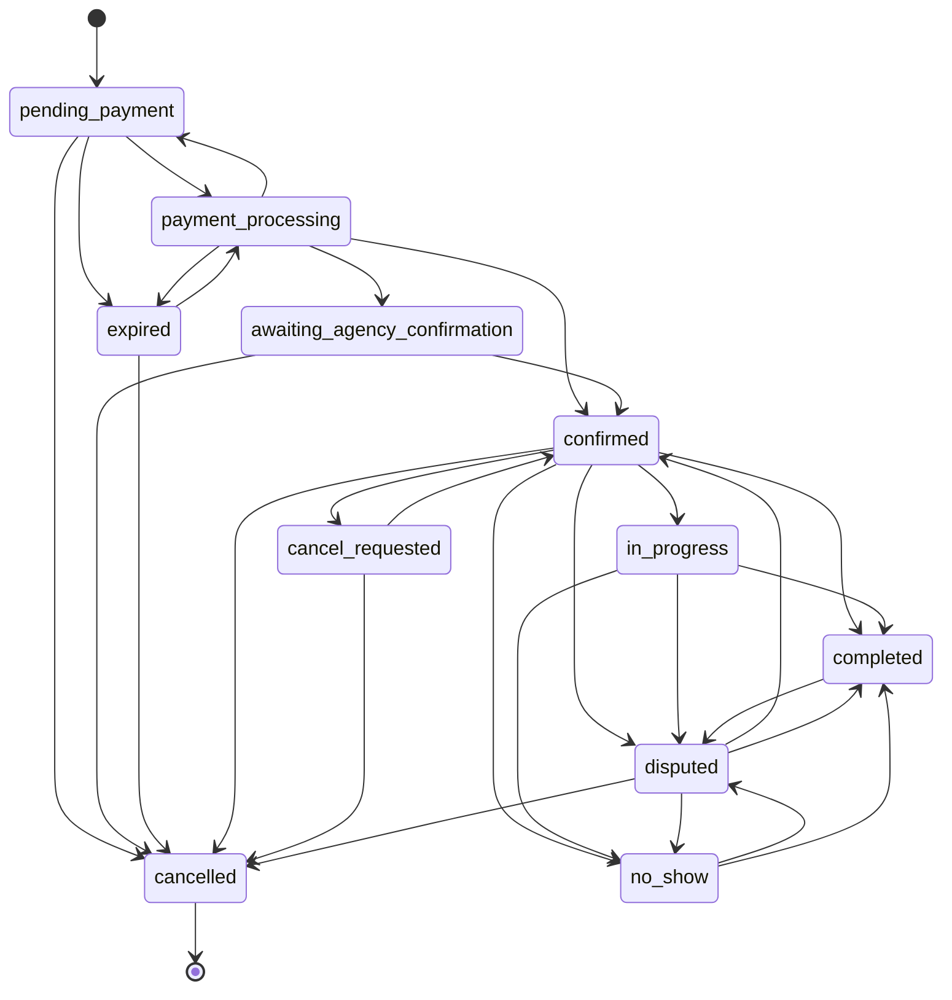

# NepalTrails — Travel Marketplace

A full-stack travel marketplace connecting travelers with verified local agencies in Nepal. Built with React, TypeScript, and Supabase.

---

## Tech Stack

| Layer | Technology |
|---|---|
| Frontend | React 18, TypeScript, Vite, Tailwind CSS, shadcn/ui |
| State | Zustand |
| Backend | Supabase (Postgres + Auth + Realtime + Edge Functions) |
| Payments | TODO — moving to an NPR-only reservation-fee model (Stripe removed) |
| Package manager | npm |

---

## Prerequisites

- **Node.js 18+** — [nodejs.org](https://nodejs.org) (npm ships with it)
- **Supabase CLI** — `brew install supabase/tap/supabase` or see [CLI docs](https://supabase.com/docs/guides/cli)
- A **Supabase** account — [supabase.com](https://supabase.com)

---

## 1. Clone and Install

```bash
git clone https://github.com/Kelennnnnnn/nepal-travel-hub.git
cd nepal-travel-hub
npm install
```

> **Note:** this project uses npm — `package-lock.json` is the committed lockfile. `bun.lock`/`bun.lockb` existed briefly from an earlier experiment and have been removed; don't regenerate them.

---

## 2. Environment Variables

```bash
cp .env.example .env.local
```

Open `.env.local` and fill in your values:

```env
VITE_SUPABASE_URL=https://your-project-ref.supabase.co
VITE_SUPABASE_ANON_KEY=your_supabase_anon_key
VITE_TURNSTILE_SITE_KEY=your_turnstile_site_key
VITE_SENTRY_DSN=
VITE_APP_ENV=development
```

Both Supabase keys are in **Supabase Dashboard → Project Settings → API**. `VITE_TURNSTILE_SITE_KEY` is the public site key for the contact form's bot-protection widget — see **Supabase → Project Settings → API** for the Supabase keys, and **Cloudflare Dashboard → Turnstile** for the Turnstile key pair (its matching secret key is an Edge Functions secret, set in step 5b, never a client-side variable).

`VITE_SENTRY_DSN` and `VITE_APP_ENV` are for frontend error tracking (`src/lib/sentry.ts`) — leave `VITE_SENTRY_DSN` empty for local development; Sentry initializes only when it's set, and the app runs identically either way. In production, set it to your Sentry project's DSN (**Sentry → Project Settings → Client Keys**) and set `VITE_APP_ENV=production` so events are tagged correctly. Events are also tagged `portal` (`www`/`partner`/`admin`) based on the request's hostname subdomain.

> **Security:** Never put `SUPABASE_SERVICE_ROLE_KEY` in `.env.local` or any client-side file. It is injected into Edge Functions as a Supabase secret only (see step 5).

---

## 3. Supabase Project Setup

### 3a. Create a project

1. Go to [supabase.com/dashboard](https://supabase.com/dashboard) and create a new project.
2. Copy the **Project URL** and **anon key** from **Settings → API** into `.env.local`.

### 3b. Run migrations

> **Note (2026-09):** this project is mid-redesign — see `PHASE_0_FORENSIC_AUDIT.md`
> and `PHASE_1_ARCHITECTURE.md` at the repo root for why, and `PHASE_2_DATABASE.md`
> for what changed here specifically. The old loose `supabase_*.sql` files and
> `MIGRATION_ORDER.md` are gone; `supabase/migrations/` is now the single
> authoritative, ordered migration sequence (target: one real migration history,
> not manually-pasted SQL Editor scripts).

```bash
supabase login
supabase link --project-ref <your-project-ref>
supabase db push
```

This applies every file in `supabase/migrations/` in order. For local development,
`supabase start` followed by `supabase db reset` spins up the full schema (including
seeded `platform_settings` defaults) against a local Postgres instance — no manual
SQL Editor steps required either way.

### 3c. Verify Realtime

This redesign does not yet enable Supabase Realtime on any table (the old
schema's `ALTER PUBLICATION supabase_realtime ADD TABLE ...` statements were
tied to tables that no longer exist in this shape). Realtime for bookings/
messages/notifications is reintroduced deliberately in a later phase (see
target spec §56 — "Use realtime only where useful... apply authorization to
realtime channels"), not carried over by default.

---

## 4. Payments

TODO — the platform is moving to a new NPR-only model (a reservation fee
paid online to the platform, with the balance paid in cash to the agency or
online later). The previous Stripe-based checkout, webhook, and payout
integration has been removed; this section returns once the new payment
provider is chosen and integrated.

---

## 5. Edge Functions Deployment

### 5a. Log in and link your project

```bash
supabase login
supabase link --project-ref your-project-ref
```

### 5b. Set secrets

```bash
supabase secrets set SUPABASE_SERVICE_ROLE_KEY=your_service_role_key

# Email — see supabase/functions/_shared/email.ts. EMAIL_MODE=mailtrap is
# refused at boot whenever ENVIRONMENT is "production".
supabase secrets set ENVIRONMENT=production
supabase secrets set EMAIL_MODE=resend
supabase secrets set FROM_EMAIL=noreply@intonepal.com
supabase secrets set SUPPORT_INBOX=support@intonepal.com

# Contact form bot protection (Cloudflare Turnstile secret key — pair it
# with VITE_TURNSTILE_SITE_KEY from step 2).
supabase secrets set TURNSTILE_SECRET_KEY=your_turnstile_secret_key

# Notification dispatch worker — the pg_cron job presents this header to
# authenticate its call to dispatch-notifications. Generate a long random
# value; it must also be stored in Supabase Vault (see 5d below).
supabase secrets set NOTIFICATIONS_CRON_SECRET=your_random_secret

# Inbox for the daily ops health alert (see 5e below) — only emailed on a
# day something actually failed, never a daily "all clear" ping.
supabase secrets set OPS_ALERT_EMAIL=ops@intonepal.com
```

The service role key is in **Supabase → Project Settings → API**.

### 5c. Deploy functions

```bash
supabase functions deploy admin-users
supabase functions deploy agency-application
supabase functions deploy review-agency-application
supabase functions deploy contact-form
supabase functions deploy send-welcome-email
supabase functions deploy agency-invitations
supabase functions deploy dispatch-notifications
```

### 5d. One-time: store the cron secret in Vault and schedule the dispatcher

`dispatch-notifications` runs every minute via `pg_cron` + `pg_net`, which
calls the deployed function over HTTP and must present the same secret set
in step 5b as a header. That secret is read from Supabase Vault at
schedule time (not baked into the migration as plaintext), so it needs to
be stored once, by hand, after secrets are set:

```sql
-- Run once in the Supabase SQL editor (or via `supabase db execute`),
-- against the SAME project the NOTIFICATIONS_CRON_SECRET secret was set on.
select vault.create_secret('your_random_secret', 'notifications_cron_secret');
```

Use the exact same value passed to `supabase secrets set NOTIFICATIONS_CRON_SECRET=...` above. The `dispatch-notifications-cron` pg_cron job (created by its migration) reads this Vault entry on every run — rotating the secret means updating both the Edge Functions secret and this Vault entry together.

### 5e. Production observability

- **Frontend error tracking** (`src/lib/sentry.ts`) needs no deploy step beyond setting `VITE_SENTRY_DSN`/`VITE_APP_ENV` (step 2) at build time — it's a static frontend env var, not an Edge Functions secret.
- **Cron health**: `public.cron_health()` (admin-only) backs the "System Health" card on `/admin` — nothing to configure, it reads `cron.job`/`cron.job_run_details` directly.
- **Daily ops alert**: `public.check_ops_daily_health()` runs once a day at 18:45 UTC (00:30 NPT) via `pg_cron`, and only queues an email (through the same `dispatch-notifications` worker as everything else) when a cron job failed in the last 24h or a notification permanently failed — a clean day sends nothing. Requires `OPS_ALERT_EMAIL` (above); no Vault step needed, this one doesn't call out over HTTP.

---

## 6. Local Development

```bash
npm run dev
```

The app runs at `http://localhost:8080`.

---

## 7. Portals and Routes

All three portals are served from the same build — access control is enforced via `user_metadata.role`.

| Portal | URL | Required role |
|---|---|---|
| Traveler (public) | `/` | None |
| Agency landing | `/agency` | None |
| Agency dashboard | `/agency/dashboard` | `agency` |
| Admin | `/admin` | `admin` |

### Creating an admin account

Register normally, then run this once in **Supabase SQL Editor**:

```sql
UPDATE auth.users
SET raw_user_meta_data = raw_user_meta_data || '{"role": "admin"}'::jsonb
WHERE email = 'your-email@example.com';
```

Sign out and back in — the role is read from the JWT on sign-in.

---

## 8. Build for Production

```bash
npm run build
```

Output is in `dist/`. Deploy to Vercel, Netlify, or Cloudflare Pages.

Add a rewrite rule for SPA routing. For Vercel, create `vercel.json`:

```json
{
  "rewrites": [{ "source": "/(.*)", "destination": "/index.html" }]
}
```

---

## 9. Booking Lifecycle and Scheduled Jobs

### Status diagram

Every edge below is enforced server-side by `guard_booking_status_transition()`
(a `BEFORE UPDATE` trigger on `bookings.booking_status`) — this is a data-integrity
invariant, not just documentation; an attempt to jump a booking between two
states with no edge between them raises `INVALID_TRANSITION` regardless of
caller (including admin and `service_role`). `draft` exists in the graph for
completeness but is never actually used in practice — `create_booking_hold()`
inserts a booking directly at `pending_payment`.



### Who can trigger each transition

| Transition | Trigger | Who |
|---|---|---|
| `pending_payment → payment_processing` | `mark_reservation_fee_paid()` | the NIC Asia webhook (`service_role` only — never exposed to any client) |
| `pending_payment → expired` | `expire_stale_booking_holds()` (cron, every minute) | system |
| `pending_payment → cancelled` | `release_booking_hold()` | the traveler (abandoning checkout) |
| `payment_processing → confirmed` | `mark_reservation_fee_paid()` | webhook, when the listing is `confirmation_mode='instant'` |
| `payment_processing → awaiting_agency_confirmation` | `mark_reservation_fee_paid()` | webhook, when `confirmation_mode='agency_confirm'` |
| `payment_processing → expired` | `expire_stale_booking_holds()` | system (the rare case the hold expires mid-payment) |
| `expired → payment_processing` | `mark_reservation_fee_paid()` | webhook, late payment arrives and capacity is still available |
| `expired → cancelled` | `mark_reservation_fee_paid()` → `cancel_booking_internal()` | system, late payment arrives but the date has since filled up (full refund) |
| `awaiting_agency_confirmation → confirmed` | `agency_respond_to_booking()` / `respond_via_token()` | the agency's manager/owner, accepting (web dashboard or the one-tap email/SMS link) |
| `awaiting_agency_confirmation → cancelled` | `agency_respond_to_booking()` / `respond_via_token()` (decline), or `expire_agency_confirmations()` (cron, every 5 min, on timeout) | agency manager/owner, or system (timeout — also records an `agency_strikes`/`agency_penalties` row) |
| `confirmed → in_progress` / `→ completed` | `agency_set_trip_status()` | the agency's manager/owner |
| `confirmed → completed` | `complete_finished_bookings()` (cron, every 15 min) | system, 24h after the quote's `end_at` with no open dispute |
| `confirmed → cancelled` | `traveler_cancel_booking()` / `agency_cancel_booking('agency_unavailable', …)` | the traveler, or the agency's manager/owner (fault-based — full refund + strike + penalty) |
| `confirmed → no_show` | `agency_mark_no_show()` | the agency's manager/owner, only between `start_at + grace` and `end_at + 24h` |
| `confirmed → disputed` | `traveler_report_agency_no_show()` | the traveler, reporting the agency never showed up |
| `confirmed → cancel_requested` | `agency_cancel_booking('conditions_weather'\|'conditions_flight'\|'conditions_safety', …)` (opens a disruption, not fault-based), or `request_booking_cancellation()` (legacy/special-request path, see below) | agency manager/owner, or the traveler via support |
| `cancel_requested → confirmed` | `traveler_reschedule()` | the traveler, picking a new open date at the same price |
| `cancel_requested → cancelled` | `traveler_choose_refund()`, or `expire_disruption_choices()` (cron, every 15 min, on timeout) | the traveler, or system (defaults to a full refund if unanswered) |
| `in_progress → completed` | `complete_finished_bookings()` (cron) / `agency_set_trip_status()` | system, or the agency's manager/owner |
| `in_progress → no_show` | `agency_mark_no_show()` | the agency's manager/owner |
| `in_progress → disputed` | `traveler_report_agency_no_show()` | the traveler |
| `no_show → disputed` | `traveler_dispute_no_show()` | the traveler, within 48h of being marked no-show |
| `disputed → confirmed` / `→ cancelled` / `→ no_show` | `admin_resolve_dispute()` | support/admin staff (`uphold_no_show`, `traveler_was_present_agency_failed`, or `partial`) |

`request_booking_cancellation()` (Prompt 4) predates the real refund engine and
only ever moves `confirmed → cancel_requested` with no refund logic of its own
— it remains as the "special request to support" path for cases
`traveler_cancel_booking()` itself rejects (e.g. after the trip has already
started), not as a second normal-cancellation path.

### Scheduled jobs (pg_cron)

| Job | Schedule | Function | Purpose |
|---|---|---|---|
| `dispatch-notifications-cron` | every minute | `trigger_dispatch_notifications()` | drains `domain_events` into emails/SMS/WhatsApp/in-app notifications |
| `expire-stale-booking-holds` | every minute | `expire_stale_booking_holds()` | releases unpaid holds past their TTL and reopens the date |
| `expire-agency-confirmations` | every 5 minutes | `expire_agency_confirmations()` | sends the 12h-left reminder once, then times out unanswered agency confirmations (full refund + strike + penalty) |
| `expire-disruption-choices` | every 15 minutes | `expire_disruption_choices()` | defaults an unanswered weather/flight/safety disruption to a full refund |
| `complete-finished-bookings` | every 15 minutes | `complete_finished_bookings()` | auto-completes trips 24h past their `end_at` with no open dispute, making them reviewable |
| `cleanup-rate-limits` | hourly (`0 * * * *`) | raw SQL | purges `rate_limits` rows older than 24h |
| `cleanup-idempotency-keys` | hourly (`0 * * * *`) | raw SQL | purges `idempotency_keys` rows older than 24h |
| `ops-daily-health-check` | daily, 18:45 UTC (00:30 NPT) | `check_ops_daily_health()` | emails `OPS_ALERT_EMAIL` only when a cron job failed or a notification permanently failed in the last 24h |

Two now-superseded jobs (`expire-stale-inventory-reservations`,
`expire-stale-booking-quotes`) were unscheduled when `expire-stale-booking-holds`
replaced both with one job that chains them in the correct order — see
`supabase/migrations/20260919000001_booking_holds.sql`.

---

## 10. Project Structure

```
nepal-travel-hub/
├── src/
│   ├── components/
│   │   ├── admin/          # AdminLayout, sidebar nav
│   │   ├── agency/         # AgencyLayout
│   │   ├── auth/           # ProtectedRoute
│   │   ├── layout/         # Public Layout (Header + Footer)
│   │   ├── reviews/        # ReviewCard, ReviewSummary, WriteReviewDialog
│   │   └── ui/             # shadcn/ui primitives
│   ├── pages/
│   │   ├── admin/          # Dashboard, Agencies, Listings, Users
│   │   ├── agency/         # Dashboard, Listings, Bookings, Earnings, etc.
│   │   └── *.tsx           # Public pages
│   ├── stores/             # Zustand: auth, listings, bookings, agencies, reviews
│   └── lib/supabase.ts     # Supabase browser client
├── supabase/
│   ├── functions/           # Edge functions — being redesigned around NIC ASIA
│   │                          and the quote/booking engine (see PHASE_1_ARCHITECTURE.md);
│   │                          this listing is stale until that phase lands, so it's
│   │                          intentionally omitted here rather than left wrong.
│   ├── migrations/          # THE authoritative, ordered schema (supabase db push
│   │                          applies these in order) — see PHASE_2_DATABASE.md
│   └── schema.types.ts      # Generated TypeScript types for the new schema
```

---

## License

ISC
